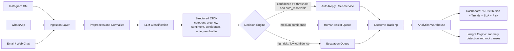

# Beast Life AI Automation and Customer Intelligence


An AI-driven customer care automation prototype for Beast Life that can automatically understand customer queries, classify problem categories, visualize issue distribution, and highlight automation opportunities to reduce support workload.

## Objective

This submission demonstrates a practical AI workflow that can:

- Automatically analyze incoming customer queries
- Classify problems into support categories
- Show percentage distribution of issue types
- Track trends over time in a dashboard
- Suggest and simulate automation strategies to reduce manual effort

## What This Prototype Covers

### 1. Customer Query Categorization

Input channels modeled in the workflow:

- Instagram DMs
- WhatsApp messages
- Email / website chat

Each message is normalized into a common schema and classified into:

- category (order, delivery, refund, product, subscription, payment, general)
- urgency (low, medium, high, critical)
- sentiment (positive, neutral, negative)
- confidence (0.0 to 1.0)
- auto_resolvable (boolean)

### 2. Problem Distribution Dashboard

The dashboard includes:

- % of total queries by category
- most frequent customer problems
- trend analysis (weekly / monthly)
- urgency and sentiment breakdowns
- assignment and escalation visibility for operations

Example distribution output:

| Issue Type | % of Queries |
| --- | ---: |
| Order Status | 35% |
| Delivery Delay | 22% |
| Refund Request | 18% |
| Product Issue | 15% |
| Other | 10% |

### 3. Automation Opportunities

Automation actions included in design:

- Auto-replies for repetitive intents (order status, basic FAQs)
- Smart FAQ/template suggestion based on category + sentiment
- AI chatbot path for product and workout questions
- Confidence-based escalation to human agents
- Priority routing for high urgency or negative sentiment messages

### 4. Tools and Workflow

Current implementation stack:

- Next.js + React + TypeScript for product UI
- Recharts for analytics visualization
- Local storage based mock persistence for repeatable demo

Production-ready integrations (recommended):

- LLM APIs: OpenAI / Groq / Azure OpenAI
- Automation: n8n / Zapier / Make
- Orchestration: LangChain or custom Node workers
- Data store: PostgreSQL / BigQuery / ClickHouse
- BI layer: Power BI / Looker Studio

## AI Workflow Architecture Diagram



## AI Categorization Logic

```python
def route_query(query):
    ai = classify(query.text)
    # ai fields: category, urgency, sentiment, confidence, auto_resolvable

    if ai.auto_resolvable and ai.confidence >= 0.80:
        return "auto_reply"
    if ai.confidence >= 0.50 and ai.urgency in ["low", "medium"]:
        return "human_assist"
    return "escalate"
```

Sample structured AI output:

```json
{
  "category": "refund_request",
  "urgency": "high",
  "sentiment": "negative",
  "confidence": 0.91,
  "auto_resolvable": true,
  "source_channel": "whatsapp"
}
```

## Sample Dataset (Demo)

| Query Text | Channel | Category | Urgency | Sentiment |
| --- | --- | --- | --- | --- |
| Where is my order #BL1023? | Instagram DM | order_tracking | medium | neutral |
| Payment failed but money was debited | WhatsApp | payment_failure | high | negative |
| I want refund for wrong size | Email | refund_request | high | negative |
| My subscription should be cancelled | Website Chat | subscription_issue | medium | negative |
| How to use this supplement? | WhatsApp | product_question | low | neutral |

## Dashboard and Intelligence Views

This prototype provides tabs and modules for:

- Query intake and searchable queue
- Analytics dashboard for trend and distribution views
- Automation insights and routing effectiveness
- Response templates and team assignment
- Workflow diagram and explainability-oriented storytelling

## Scalability Strategy

How this scales with higher query volume:

- Event-driven ingestion from channels into queue or stream
- Batched or streaming LLM inference with retry and fallback models
- Confidence-threshold automation to reduce human ticket load
- Priority queues by urgency and business risk
- Horizontal worker scaling for classification and routing
- Central metrics store for real-time dashboards

Expected result at scale:

- 60-80% repetitive query automation
- lower average response time
- improved agent focus on edge cases and escalations

## Assignment Deliverables Mapping

- Workflow explanation: included in architecture section and Mermaid diagram
- Sample dataset/example queries: included above
- AI categorization logic: included in pseudocode + JSON schema
- Dashboard mockup/working dashboard: implemented in app UI
- Scalability explanation: included in scalability strategy section

## Local Setup

### Prerequisites

- Node.js 20+
- pnpm 9+

### Install

```bash
pnpm install
```

### Run

```bash
pnpm dev
```

Open http://localhost:3000

### Build and Start

```bash
pnpm build
pnpm start
```

### Lint

```bash
pnpm lint
```

## Scripts

- `pnpm dev` - start development server
- `pnpm build` - build production artifacts
- `pnpm start` - run production build
- `pnpm lint` - run lint checks

## Repository Structure

```text
app/                  # Next.js app router entry and dashboard shell
components/           # Feature modules (queries, analytics, automation, team)
components/ui/        # Reusable UI primitives
hooks/                # Reusable React hooks
lib/                  # Types, storage, utilities, provider clients
styles/               # Global style layers
SUBMISSION_GUIDE.md   # Extended assignment workflow narrative
```

## Demo Notes

- This prototype is intentionally built for rapid assignment demonstration.
- Data is demo-oriented and can be swapped with live support events.
- LLM and automation platforms are designed as pluggable integrations.

## License

Assignment and educational use.
