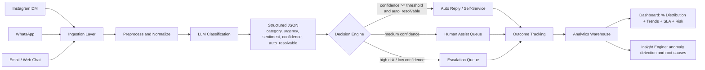

# Beast Life AI Automation and Customer Intelligence


An AI-driven customer care automation prototype for Beast Life that can automatically understand customer queries, classify problem categories, visualize issue distribution, and highlight automation opportunities to reduce support workload.

## Objective

This submission demonstrates a practical AI workflow that can:

- Automatically analyze incoming customer queries
- Classify problems into support categories
- Show percentage distribution of issue types
- Track trends over time in a dashboard
- Suggest and simulate automation strategies to reduce manual effort

## Why This Matters for Beast Life

For a fast-growing startup, support quality directly impacts retention and revenue. This system is designed to:

- reduce first response time during spikes
- prevent churn by identifying unresolved negative sentiment early
- show leadership a live view of top customer pain points
- improve team efficiency with automation-first triage

## What This Prototype Covers

### 1. Customer Query Categorization

Input channels modeled in the workflow:

- Instagram DMs
- WhatsApp messages
- Email / website chat

Each message is normalized into a common schema and classified into:

- category (order, delivery, refund, product, subscription, payment, general)
- urgency (low, medium, high, critical)
- sentiment (positive, neutral, negative)
- confidence (0.0 to 1.0)
- auto_resolvable (boolean)

### 2. Problem Distribution Dashboard

The dashboard includes:

- % of total queries by category
- most frequent customer problems
- trend analysis (weekly / monthly)
- urgency and sentiment breakdowns
- assignment and escalation visibility for operations

Example distribution output:

| Issue Type | % of Queries |
| --- | ---: |
| Order Status | 35% |
| Delivery Delay | 22% |
| Refund Request | 18% |
| Product Issue | 15% |
| Other | 10% |

### 3. Automation Opportunities

Automation actions included in design:

- Auto-replies for repetitive intents (order status, basic FAQs)
- Smart FAQ/template suggestion based on category + sentiment
- AI chatbot path for product and workout questions
- Confidence-based escalation to human agents
- Priority routing for high urgency or negative sentiment messages

### 4. Tools and Workflow

Current implementation stack:

- Next.js + React + TypeScript for product UI
- Recharts for analytics visualization
- Local storage based mock persistence for repeatable demo

Production-ready integrations (recommended):

- LLM APIs: OpenAI / Groq / Azure OpenAI
- Automation: n8n / Zapier / Make
- Orchestration: LangChain or custom Node workers
- Data store: PostgreSQL / BigQuery / ClickHouse
- BI layer: Power BI / Looker Studio

## AI Workflow Architecture Diagram



## Workflow Components (Detailed)

| Layer | Responsibility | Example Tools |
| --- | --- | --- |
| Ingestion | Collect and normalize Instagram, WhatsApp, Email, Chat events | Webhooks, API connectors, queue consumers |
| AI Understanding | Extract intent + urgency + sentiment + confidence | LLM API with structured output |
| Decision Engine | Choose auto-reply, assist, or escalation path | Rule engine with confidence thresholds |
| Automation Actions | Trigger templates, self-service, or assignment | n8n / Zapier / internal worker |
| Data and Analytics | Persist events and outcomes for reporting | PostgreSQL + BI or analytics warehouse |
| Insight Engine | Detect spikes, top root causes, and risk signals | Time-series analysis + anomaly rules |

## End-to-End Processing Sequence

1. Query received from one of the channels
2. Message normalized into common event schema
3. AI classifies category, urgency, sentiment, and confidence
4. Decision engine checks policy and confidence threshold
5. Action chosen: auto-resolve, human assist, or escalation
6. Outcome logged for learning loop and dashboard tracking
7. Insights updated: issue share %, trend, risk, automation savings

## AI Categorization Logic

```python
def route_query(query):
    ai = classify(query.text)
    # ai fields: category, urgency, sentiment, confidence, auto_resolvable

    if ai.auto_resolvable and ai.confidence >= 0.80:
        return "auto_reply"
    if ai.confidence >= 0.50 and ai.urgency in ["low", "medium"]:
        return "human_assist"
    return "escalate"
```

Sample structured AI output:

```json
{
  "category": "refund_request",
  "urgency": "high",
  "sentiment": "negative",
  "confidence": 0.91,
  "auto_resolvable": true,
  "source_channel": "whatsapp"
}
```

## Sample Dataset (Demo)

| Query Text | Channel | Category | Urgency | Sentiment |
| --- | --- | --- | --- | --- |
| Where is my order #BL1023? | Instagram DM | order_tracking | medium | neutral |
| Payment failed but money was debited | WhatsApp | payment_failure | high | negative |
| I want refund for wrong size | Email | refund_request | high | negative |
| My subscription should be cancelled | Website Chat | subscription_issue | medium | negative |
| How to use this supplement? | WhatsApp | product_question | low | neutral |

## Suggested Expanded Categories

- order_tracking
- delivery_delay
- refund_request
- product_complaint
- subscription_issue
- payment_failure
- product_question
- other

This allows straightforward % distribution reporting and SLA policies by category.

## Dashboard and Intelligence Views

This prototype provides tabs and modules for:

- Query intake and searchable queue
- Analytics dashboard for trend and distribution views
- Automation insights and routing effectiveness
- Response templates and team assignment
- Workflow diagram and explainability-oriented storytelling

## Scalability Strategy

How this scales with higher query volume:

- Event-driven ingestion from channels into queue or stream
- Batched or streaming LLM inference with retry and fallback models
- Confidence-threshold automation to reduce human ticket load
- Priority queues by urgency and business risk
- Horizontal worker scaling for classification and routing
- Central metrics store for real-time dashboards

Expected result at scale:

- 60-80% repetitive query automation
- lower average response time
- improved agent focus on edge cases and escalations

## Business KPI Impact (Target)

| KPI | Baseline | Target After Automation |
| --- | ---: | ---: |
| First response time | 25 min | < 5 min |
| Auto-resolved tickets | 0% | 60-80% |
| Escalation accuracy | N/A | > 90% policy precision |
| Agent productivity | 1.0x | 1.7x |
| Negative sentiment backlog | High | Reduced by priority routing |

## Human-in-the-Loop Safeguards

- confidence floor before autonomous action
- sensitive intents (payments/refunds) can require validation
- full override path for agents
- audit trail for every automated decision
- periodic prompt + threshold review to avoid model drift

## 60-Second Demo Walkthrough

1. Open the query queue and show mixed incoming channels.
2. Explain AI labels on each ticket (category, urgency, sentiment, confidence).
3. Switch to analytics to show issue % distribution and trend chart.
4. Open automation insights to show auto-resolve vs human-assist split.
5. Show escalation logic for critical/low-confidence tickets.
6. Close with startup impact: faster response, fewer manual tickets, better visibility.

## Screenshots / GIF (Optional)

Add screenshots here before final submission:

- Dashboard overview
- Category distribution widget
- Automation decision view
- Team assignment / escalation panel

If needed, capture with:

- Windows Snipping Tool for images
- ScreenToGif for short workflow GIFs

## Assignment Deliverables Mapping

- Workflow explanation: included in architecture section and Mermaid diagram
- Sample dataset/example queries: included above
- AI categorization logic: included in pseudocode + JSON schema
- Dashboard mockup/working dashboard: implemented in app UI
- Scalability explanation: included in scalability strategy section

## What Evaluators Should Notice

- Practical workflow design, not just UI mock screens
- AI plus automation plus operational governance
- clear linkage from customer messages to measurable business outcomes
- architecture that can move from prototype to production

## Local Setup

### Prerequisites

- Node.js 20+
- pnpm 9+

### Install

```bash
pnpm install
```

### Run

```bash
pnpm dev
```

Open http://localhost:3000

### Build and Start

```bash
pnpm build
pnpm start
```

### Lint

```bash
pnpm lint
```

## Scripts

- `pnpm dev` - start development server
- `pnpm build` - build production artifacts
- `pnpm start` - run production build
- `pnpm lint` - run lint checks

## Repository Structure

```text
app/                  # Next.js app router entry and dashboard shell
components/           # Feature modules (queries, analytics, automation, team)
components/ui/        # Reusable UI primitives
hooks/                # Reusable React hooks
lib/                  # Types, storage, utilities, provider clients
styles/               # Global style layers
SUBMISSION_GUIDE.md   # Extended assignment workflow narrative
```

## Demo Notes

- This prototype is intentionally built for rapid assignment demonstration.
- Data is demo-oriented and can be swapped with live support events.
- LLM and automation platforms are designed as pluggable integrations.

## GitHub Presentation Suggestions

Repository description suggestion:

AI-driven customer care automation dashboard for Beast Life with query classification, issue distribution analytics, and scalable support workflows.

Repository topics suggestion:

`nextjs`, `typescript`, `customer-support`, `ai-automation`, `analytics-dashboard`, `workflow-automation`, `llm`, `startup-ops`

## License

Assignment and educational use.
